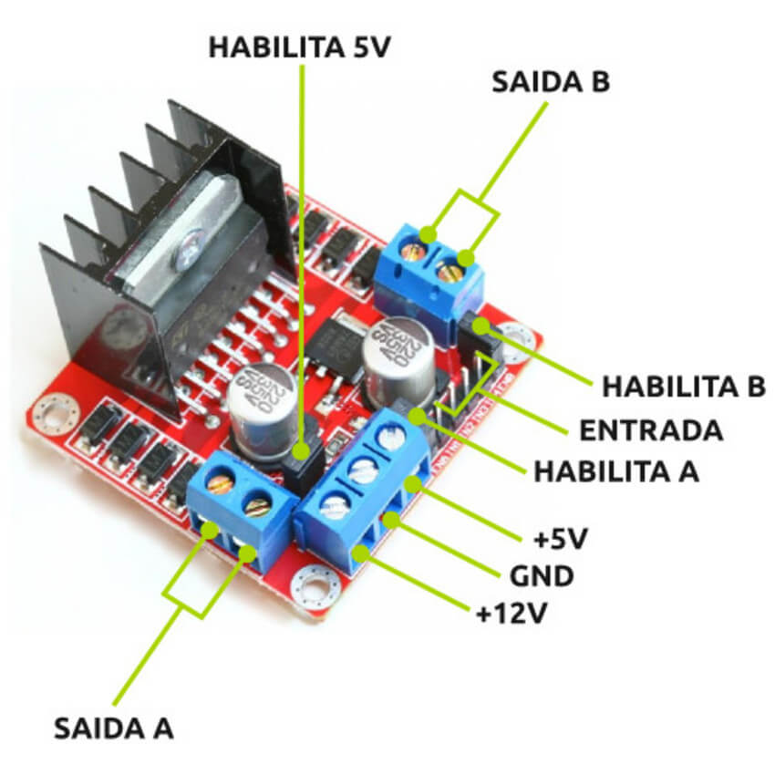
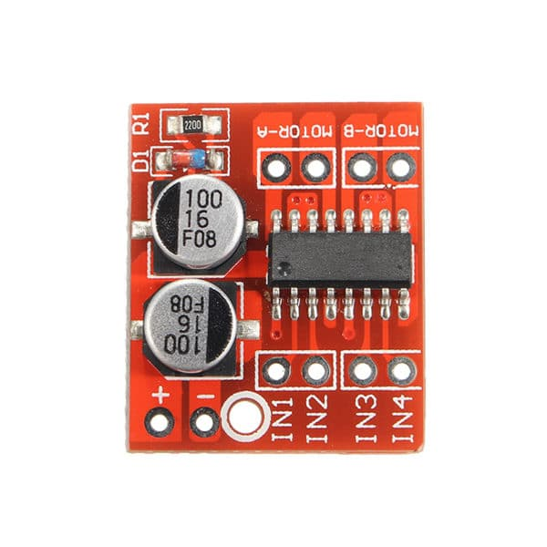

### Módulo 2: O Robô e o conceito de Agregação (1 hora)

Depois de vermos o basico das classes. Vamos discutir sobre o controle de um motor.
Como controla um motor? Um motor elétrico funciona da seguinte maneira:
Ao aplicar tensão elétrica nele, ele gira em uma direção. 
Ao aplicar tensão elétrica nele com a polaridade invertida, ele gira na direção contrária.
E quando você aplica tensão pulsada nele, ele gira em uma velocidade proporcional à largura dos pulsos (Duty Cycle).
A tensão pulsada é o que usamos na robótica para controlar a velocidade de um motor. Essa tensão pulsada é gerada pelo pino de saída do microcontrolador com a função PWM (Pulse Width Modulation).

Para um motor robótico, o sinal que mandamos do microcontrolador é de no máximo 3.3V ou 5V (baixa corrente). Isso é suficiente para acender um LED, mas não para girar um motor com força.  Para isso, utilizamos um módulo chamado **Ponte H**, alimentado por uma bateria externa. Como estamos usando uma **Mini Ponte H** (como a MX1508), o funcionamento é bem esperto. Existe também a ponte H L298N que é mais comum em robôs e que tem um funcionamento levemente diferente.

A Mini Ponte H tem 2 pinos de controle para cada motor (ex: IN1 e IN2). Para ir para frente, ligamos um pino e desligamos o outro. Para ir para trás, invertemos. E para controlar a velocidade, aplicamos o sinal de PWM diretamente no pino que está ligado!
Já com a ponte H L298N, temos 4 pinos de controle para cada motor (ex: IN1, IN2, IN3, IN4). Para ir para frente, ligamos IN1 e desligamos IN2. Para ir para trás, desligamos IN1 e ligamos IN2. E para controlar a velocidade, aplicamos o sinal de PWM diretamente no pino que está ligado!



Isso pode ser visto assim na mini ponte H
```c
// Motor girando para frente com velocidade média (50%)
analogWrite(pinoIN1, 128); // 128/255 = 50%
digitalWrite(pinoIN2, LOW);

// Motor girando para trás com velocidade média (50%)
digitalWrite(pinoIN1, LOW);
analogWrite(pinoIN2, 128);

// Motor freando
digitalWrite(pinoIN1, LOW);
digitalWrite(pinoIN2, LOW);
```
Na L298N (Modo com 3 pinos: ENA, IN1, IN2)
```c
// Motor girando para frente com velocidade média (50%)
digitalWrite(pinoIN1, HIGH);
digitalWrite(pinoIN2, LOW);
analogWrite(pinoENA, 128); // 128/255 = 50%

// Motor girando para trás com velocidade média (50%)
digitalWrite(pinoIN1, LOW);
digitalWrite(pinoIN2, HIGH);
analogWrite(pinoENA, 128);

// Motor freando
digitalWrite(pinoIN1, LOW);
digitalWrite(pinoIN2, LOW);
analogWrite(pinoENA, 0);
```

Na L298N (Modo com 2 pinos: Jumper no ENA mantendo em HIGH)
```c
// Motor girando para frente com velocidade média (50%)
analogWrite(pinoIN1, 128); // 128/255 = 50%
digitalWrite(pinoIN2, LOW);

// Motor girando para trás com velocidade média (50%)
digitalWrite(pinoIN1, LOW);
analogWrite(pinoIN2, 128);

// Motor freando
digitalWrite(pinoIN1, LOW);
digitalWrite(pinoIN2, LOW);
```

Sabendo disso, vamos para etapa conceitual. Como vamos representar um motor em termos de classe? Lembrem-se, classes são abstrações de objetos.
O nosso motor consegue girar em duas direções e em diferentes velocidades usando apenas dois pinos conectados à Mini Ponte H. A única exigência é que ambos os pinos no microcontrolador tenham suporte a PWM. Suporte porque nem todos os pinos da esp são capazes de executar essa tarefa. Temos pinos para outras funções como por exemplo: I2C, SPI, UART, GPIO, etc. Não precisamos nos preocupar com isso agora. A única coisa que importa é que o pino tenha suporte a PWM. Apenas saibam que isso existe e é uma limitação do hardware.

### A função LEDC no ESP32

Nos exemplos mais simples e no mundo do Arduino tradicional, usamos muito `analogWrite()` e `digitalWrite()`. No entanto, o ESP32 possui um periférico de hardware nativo e muito eficiente para geração de PWM chamado **LEDC** (LED Control). Embora o nome cite "LED", ele é a maneira mais robusta de controlar motores no ESP32.

O uso do LEDC exigia alguns passos complexos em versões antigas, mas na nova versão do pacote do ESP32 para Arduino (Core 3.x+) ficou muito mais simples, usando apenas dois passos:
1. **Configurar o Pino e Frequência:** Usamos a função `ledcAttach(pino, frequencia, resolucao)` (ex: frequencia de `5000` Hz e resolução de `8` bits, que dá valores de 0 a 255). O ESP32 agora gerencia os "canais" de hardware automaticamente nos bastidores, então não precisamos mais definir um canal de 0 a 15 para cada pino!
2. **Escrever o Valor (Duty Cycle):** Para alterar a velocidade, simplesmente usamos `ledcWrite(pino, valor)`.

Então, para usar o LEDC de forma correta e moderna, nossa classe motor precisará armazenar apenas os **pinos**. Com eles, o motor consegue girar pra frente, pra trás e frear, tudo isso variando a velocidade através do LEDC.

Sabendo disso, podemos partir para a criação da nossa classe motor otimizada para o ESP32:

```cpp
class Motor{
private:
    // Pinos físicos do nosso motor (para direcao)
    int pino1;
    int pino2;
    int frequencia_hz = 5000;
    int resolucao = 8;
public:

    Motor(int pino1, int pino2): 
        pino1(pino1), pino2(pino2) {}

    void begin() {
        // Na nova versão (Arduino Core 3.x+), usamos apenas ledcAttach passando o pino físico.
        // O sistema gerencia os canais internamente para nós!
        ledcAttach(pino1, frequencia_hz, resolucao);
        ledcAttach(pino2, frequencia_hz, resolucao);
        
        parar(); // Começa com os motores parados
    }
    
    void frente(int velocidade){
        // Na nova versão, ledcWrite recebe o PINO
        ledcWrite(pino1, velocidade);
        ledcWrite(pino2, 0);
    }

    void tras(int velocidade){
        ledcWrite(pino1, 0);
        ledcWrite(pino2, velocidade);
    }

    void parar(){
        ledcWrite(pino1, 0);
        ledcWrite(pino2, 0);   
    }
};

// Instanciamos os motores informando apenas os pinos
Motor motorEsquerdo(13, 12);
Motor motorDireito(14, 27);

void setup(){
    motorEsquerdo.begin();
    motorDireito.begin();
}

void loop(){
    // vai andar para frente por 1 segundo
    motorEsquerdo.frente(128);
    motorDireito.frente(128);
    delay(1000);

    // vai parar por 1 segundo (isso evita que o motor continue girando um pouco por inércia e a troca de direção seja mais suave)
    motorEsquerdo.parar();
    motorDireito.parar();
    delay(1000);

    // vai andar para trás por 1 segundo
    motorEsquerdo.tras(128);
    motorDireito.tras(128);
    delay(1000);
    motorEsquerdo.parar();
    motorDireito.parar();
}

```

Veja como o código fica mais legivel e abstraimos o hardware. Não preciso dizer que pino deve fazer o que e em que momento para andar pra frente. Apenas chamo o método `frente()`.


# Agregação

Agora vamos pensar em como representar o robô em termos de classe. O robô tem dois motores, um de cada lado. Como podemos representar isso em termos de classe? 

Podemos pensar que o robô tem dois motores. Podemos pensar que o nosso robo vai para frente e faz curvas para direita e para esquerda. Basicamente ele vai andar para frente por um determinado tempo, depois vai parar por um determinado tempo, depois vai andar para trás por um determinado tempo, depois vai parar por um determinado tempo e assim por diante. E claro, ele pode girar para esquerda e para direita. Ele pode rodopiar no seu próprio eixo. Basicamente são esses os movimentos que ele consegue fazer. Além de poder brincar com os proprios leds, ou seja, acender, apagar e piscar os leds. E claro, ele pode fazer tudo isso ao mesmo tempo. Ou seja, ele pode andar pra frente e piscar os leds ao mesmo tempo. E assim por diante.

Isso de pensar em termos de o meu robô possui y coisas é o que chamamos de agregação.

Vamos agora representar o robô em termos de classe:

```cpp
class Robo{
private:
    Motor motorEsquerdo;
    Motor motorDireito;

public:
    void frente(int velocidade){
        motorEsquerdo.frente(velocidade);
        motorDireito.frente(velocidade);
    }

    void tras(int velocidade){
        motorEsquerdo.tras(velocidade);
        motorDireito.tras(velocidade);
    }

    void parar(){
        motorEsquerdo.parar();
        motorDireito.parar();
    }
    void virarParaDireita(int velocidade){
        motorEsquerdo.frente(velocidade);
        motorDireito.tras(velocidade);
    }
    void virarParaEsquerda(int velocidade){
        motorEsquerdo.tras(velocidade);
        motorDireito.frente(velocidade);
    }
    void rodopiarParaDireita(int velocidade){
        motorEsquerdo.frente(velocidade);
        motorDireito.tras(velocidade);
    }
    void rodopiarParaEsquerda(int velocidade){
        motorEsquerdo.tras(velocidade);
        motorDireito.frente(velocidade);
    }
    void rotinaDoQuadrado(){
        frente(128);
        delay(1000);
        parar();
        delay(1000);
        virarParaDireita(128);
        delay(1000);
        parar();
        delay(1000);
        frente(128);
        delay(1000);
        parar();
        delay(1000);
        virarParaDireita(128);
        delay(1000);
        parar();
        delay(1000);
    }

};
```

*Nota de rodapé histórica:* O pacote do ESP32 para Arduino recentemente sofreu uma grande atualização (Core 3.0+). Em versões mais antigas, o código exigia gerenciar manualmente os canais de hardware (usando `ledcSetup` e `ledcAttachPin`). A nova versão simplificou tudo, permitindo usar diretamente `ledcAttach(pino)` e `ledcWrite(pino)`. Vale notar que a função padrão `analogWrite()` agora funciona nativamente no ESP32 também (sem precisar de bibliotecas de terceiros), mas o `ledcAttach` continua sendo a opção mais profissional, pois nos dá controle total sobre a frequência do sinal.

> **Dúvidas Comuns:**
> 
> **1. O que é um canal de PWM? E por que não definimos mais eles?**
> Um canal de PWM é um gerador de sinal interno (circuito lógico) dentro do chip do ESP32 (o periférico LEDC). O ESP32 possui 16 canais desses (0 a 15). No passado, nós programadores tínhamos que gerenciar isso manualmente, escolhendo e roteando os canais 0, 1, 2, 3 para os pinos do motor. Na nova versão, quando você chama `ledcAttach(pino, ...)`, o próprio sistema do ESP32 procura um canal interno livre e faz a ligação para você de forma automática! Muito mais simples, né?
> 
> **2. E os pinos de Enable? Para onde foram?**
> Depende de qual ponte H você está usando no seu robô:
> - Na **Mini Ponte H (MX1508)**: Ela **não possui** pinos de Enable! Nós geramos o PWM diretamente nos pinos de direção (IN1 e IN2).
> - Na **Ponte H L298N**: Ela possui os pinos ENA e ENB. Se for usá-la, a lógica muda: o PWM deve ser aplicado no pino ENA, enquanto os pinos IN1/IN2 recebem apenas sinais digitais puramente lógicos (`digitalWrite` HIGH ou LOW) para definir a direção.
> 
> *No nosso código, usamos a lógica da Mini Ponte H (PWM direto nos INs), que é muito comum em pequenos projetos e economiza pinos.*

